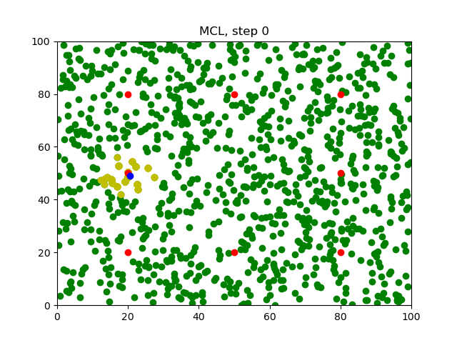
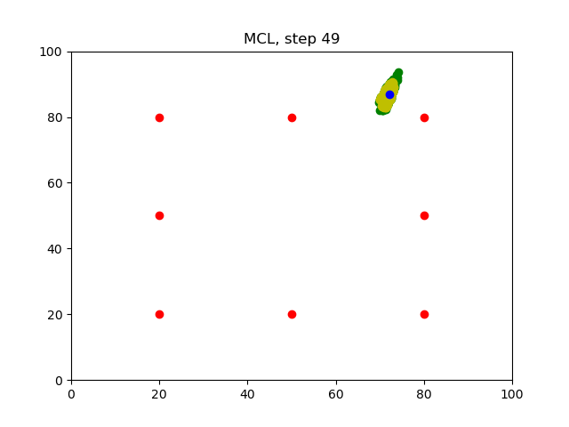

[](https://www.udacity.com/robotics)

# RoboND-MCL-Lab
You will be able to observe the `MCL` in action through the generated images. 
Note: use ubuntu 20.04 and python 3.8 instead
### Editing the Program
Enter the code in the designated section:
```C++
//####   DON'T MODIFY ANYTHING ABOVE HERE! ENTER CODE BELOW ####
		
//TODO: Graph the position of the robot and the particles at each step 
```

### Compiling the Program
```sh
$ cd /home/workspace/
$ git clone https://github.com/udacity/RoboND-MCL-Lab
$ cd RoboND-MCL-Lab/
$ rm -rf Images/*
$ g++ main.cpp -o app -std=c++11 -D WITHOUT_NUMPY  -I/usr/include/python3.8 -lpython3.8
```

### Running the Program
Before you run the program, make sure the `Images` folder is empty!
```sh
$ ./app
```
Wait for the program to iterate `50` times.

### Generated Images
After running the program, `50` images will be generated in the `Images` folder.
#### Step0

#### Step49


